# Introduction

Nxs-chat-srv is a Telegram Bot that allows linking Redmine and Telegram.

At the moment nxs-chat-bot supports only English and Russian languages.
You may create files in json format for your languages.

## Nixys Demo Chat

You can try the Nxs-chat-srv demo: https://demo.nxs-chat.nixys.ru

To do that you need to make several simple steps describes below.

**Create 2 accounts in Redmine**

Go to: https://demo.nxs-chat.nixys.ru/account/register and register two accounts (to make possible sending and receiving notifications in Telegram).
Filling out the `Telegram` field for at least one of the accounts is required.

**Activate the created accounts**

You will receive a confirmation email for each of the created accounts. Please follow the activation link to confirm email address.

**Find the Nixys Demo Chat Bot**

Now find the [@nixys_demo_chat_bot](https://t.me/nixys_demo_chat_bot) for each account that you created with `Telegram` field specified.

Make sure you have the same usernames in your Telegram accounts settings.

Once you find the bot in Telegram click **Start** button.

**Create a project in Redmine**

You need to [create the project in Redmine](https://demo.nxs-chat.nixys.ru/projects/new) and add your created accounts as its members (as `Project member`).

**Create an issue and start messaging**

The last step is to create an issue in your project and start messaging in it with created accounts.

Important: Bot will send notifications to Telegram account in the following cases:
* If that account is author of issue
* If issue is assigned to that account
* If account in on the watch list of the issue

## Installation

### Debian

* Add the Nixys repository key:
  ```
  apt-key adv --fetch-keys http://packages.nixys.ru/packages.nixys.ru.gpg.key
  ```

* Add the repository:
  * Debian Jessie:
  ```
  echo "deb [arch=amd64] http://packages.nixys.ru/debian/ jessie main" > /etc/apt/sources.list.d/packages.nixys.ru.list
  ```
  * Debian Stretch:
  ```
  echo "deb [arch=amd64] http://packages.nixys.ru/debian/ stretch main" > /etc/apt/sources.list.d/packages.nixys.ru.list
  ```

* Make an update:
  ```
  apt-get update
  ```

* Install nxs-chat-srv package:
  ```
  apt-get install nxs-chat-srv
  ```

### CentOS

* Add Nixys repository key:
  ```
  rpm --import http://packages.nixys.ru/packages.nixys.ru.gpg.key
  ```

* Add the repository. Currently CentOS 7 is available:
  ```
  cat <<EOF > /etc/yum.repos.d/packages.nixys.ru.repo
  [packages.nixys.ru]
  name=Nixys Packages for CentOS \$releasever - \$basearch
  baseurl=http://packages.nixys.ru/centos/\$releasever/\$basearch
  enabled=1
  gpgcheck=1
  gpgkey=http://packages.nixys.ru/packages.nixys.ru.gpg.key
  EOF
  ```

* Install nxs-chat-srv package:
  ```
  yum install nxs-chat-srv
  ```

### Other OS

To install nxs-chat-srv for other operating systems you need to use Docker. The manual is described below.

* Download the tar with Dockerfile and entrypoint script:
  ```
  cd /tmp
  wget -O /tmp/nxs-chat-srv_docker.tar.gz https://raw.githubusercontent.com/nixys/nxs-chat-srv/master/docs/nxs-chat-srv_docker.tar.gz
  ```
* Untar the archive and go into:
  ```
  tar zxfv nxs-chat-srv_docker.tar.gz
  cd nxs-chat-srv_docker
  ```
* Build the Docker image:
  ```
  docker build -t nxs-chat-srv .
  ```
* Prepare the configuration environment for nxs-chat-srv container (you must make all follow steps in this environment):
  ```
  mkdir -p /var/lib/nxs-chat-srv-docker/etc/ssl
  mkdir -p /var/lib/nxs-chat-srv-docker/log
  mkdir -p /var/lib/nxs-chat-srv-docker/spool/{tlgrm,rdmn}
  chmod 750 /var/lib/nxs-chat-srv-docker
  ```
* Download the nxs-chat-srv config file into /var/lib/nxs-chat-srv-docker/etc/:
  ```
  wget -O /var/lib/nxs-chat-srv-docker/etc/nxs-chat-srv.conf https://raw.githubusercontent.com/nixys/nxs-chat-srv/master/build-pkgs-conf/pkg/general/etc/nxs-chat-srv/nxs-chat-srv.conf
  ```
* Make sure option `proc.daemonize` in /var/lib/nxs-chat-srv-docker/etc/nxs-chat-srv.conf has value `false`
* Configure your nxs-chat-srv server, Redmine and then run the Docker container:
  ```
  docker run -d --hostname nxs-chat-srv \
    --name nxs-chat-srv \
    --restart=always --publish 8443:8443 \
    --env "NXS_CHAT_SRV_INITIALIZE=-i set_webhook -i create_tables" \
    --volume "/var/lib/nxs-chat-srv-docker/etc:/etc/nxs-chat-srv" \
    --volume "/var/lib/nxs-chat-srv-docker/log:/var/log/nxs-chat-srv/" \
    --volume "/var/lib/nxs-chat-srv-docker/spool/tlgrm:/var/spool/nxs-chat-srv/tlgrm" \
    --volume "/var/lib/nxs-chat-srv-docker/spool/rdmn:/var/spool/nxs-chat-srv/rdmn" \
    nxs-chat-srv:latest
  ```
  If nxs-chat-srv already has been initialized you may remove the `--env "NXS_CHAT_SRV_INITIALIZE=-i set_webhook -i create_tables"` from docker run command.
  
_Note that all paths and hosts IPs specified in /var/lib/nxs-chat-srv-docker/etc/nxs-chat-srv.conf are relative for Docker container!_ 

### Redmine nxs-chat Redmine plugin

Also you need to install [nxs-chat](https://github.com/nixys/nxs-chat-redmine) Redmine plugin.

## Settings

Default configuration file locacation is /etc/nxs-chat-srv/nxs-chat-srv.conf.
Config file is in JSON format.

### `proc`

Nxs-chat-srv process settings block description.

* `pid_file`: nxs-chat-srv pid file path.
* `queue_worker_term_timeout`: timeout in seconds to wait for queue-worker subrocesses to terminate.
* `rest_api_term_timeout`: rest-api subrocesses termination wait timeout seconds.
* `daemonize`: whether or not daemonize nxs-chat-srv.

### `logging`

Loging settings block description.

* `level`: loglevel detalization.
* `path`: logfile path.

### `bind`

Bind settings block description.

* `iface`: bind address.
* `port`: bind port.
* `ssl` (object):
  * `use_ssl`: whether or not to use SSL certificate to protect the incomming connections from Telegram and Redmine.
  * `crt`: SSL certificate file path.
  * `key`: SSL certificate private key file path.

### `telegram`

Telegram settings block description.

* `bot_api_addr`: Telegram Bot API host (default: https://api.telegram.org).
* `bot_api_key`: Telegram Bot API key.
* `auth_token`: part of URL secret path to make sure requests come from Telegram (for details see: https://core.telegram.org/bots/api#setwebhook).
* `webhook_host`: URL (including protocol and port) to take Telegram updates.

### `mysql`

MySQL settings block description.

* `name`: MySQL DB name.
* `user`: MySQL DB user.
* `pass`: MySQL DB password.
* `host`: MySQL DB host.
* `port`: MySQL DB port.

### `redis`

Redis settings block description.

* `keys_space`: prefix for all nxs-chat-srv instance keys stored in Redis.
* `cluster`: wheter or not to use Redis Cluster (use false for Redis Standalone mode).
* `nodes` (objects array) specify one node for Redis Standalone mode or array of nodes for Redis Cluster mode:
  * `host`: Redis instance host.
  * `port`: Redis instance port.

### `redmine`

Redmine settings block description.

* `url`: This option is used to create links to Redmine issues in Telegram messages. It's useful to make for users a valid links in case if Redmine has host address in internal network (e.g. in Docker installations).
If not specified, `redmine.host` option value will be used.
* `host`: Redmine host URL (e.g. https://redmine.company.org:3000). This value is used to connections with Redmine API.
* `api_key`: Redmine Rest API key account (with _Administrator_ permissions). Used for Redmine interactions (e.g. get users list, projects list, etc).
* `auth_token`: part of URL secret path to make sure requests come from Redmine.
* `presale_project_name`: Redmine project name where messages from users without Telegram account specified will be delivered as separate issues.
* `presale_api_key`: Redmine Rest API key for _presale_ account.
* `issue_list_query_id`: Redmine query ID to get issues available for a user.
* `ssl_verifyhost`: whether or not to verify Redmine host SSL certificate.
* `cf_telegram`: Redmine custom field ID with user Telegram username.
* `status_in_progress`: Redmine _In progress_ status ID
* `status_need_feedback`: Redmine _Need feedback_ status ID
* `status_resolved`: Redmine _Resolved_ status ID

### `ra_queue`

Rest API queue process settings block description.

* `pop_timeout_ms`: microseconds sleep timeout between data processing operations from Rest API queue.
* `queue_workers`: Rest API queue workers processes count.

### `cache`

Cache settings block description.

* `projects_ttl`: projects cache TTL
* `users_ttl`: users cache TTL
* `issue_priorities_ttl`: issue priorities cache TTL
* `lock_file`: cache lock file path. Create empty file to disable cache. Use this option to make sure cache processing only for one nxs-caht-srv node in cluster mode.

### `dev_accounts`

Development accounts settings block description.

Strings array contains the Telegram usernames allowed to work with nxs-chat. Useful for development purposes.

### `attachments`

Attachments settings block description.

* `tlgrm_download_tmp_dir`: Telegram attachments download tmp dir.
* `rdmn_download_tmp_dir`: Redmine attachments download tmp dir.

### `statistic`

Statistic settings block description.

* `auth_token`: part of URL secret path to access the nxs-chat-bot statistics page.

### `labels`

Labels settings block description.

This block is used to translate user Telegram bot interface to their language specified in Redmine.

* `default_lang`: default language (default: en).
* `labels_path`: path to the directory with language files (default: /usr/share/nxs-chat-srv/labels/).

### `greetings`

Description of the settings block for the greeting message.

Bot replies with a greeting message in accordance with language specified in Redmine account settings after receiving '/start' command from user.

This block is an objects array:
* `lang`: greeting language
* `text`:  greeting text

If there are no greetings for user language the greeting for default language will be used.

## Configuration

To set up nxs-chat-srv you need:
* Domain (i.e., demo.nxs-chat.nixys.ru)
* SSL certificate for this domain (you can use either trusted certificate (e.g. https://letsencrypt.org/), or self-signed certificate (in this case read this before: https://core.telegram.org/bots/self-signed))
* Telegram bot (see https://core.telegram.org/bots#3-how-do-i-create-a-bot)
* Redmine (see http://www.redmine.org/projects/redmine/wiki/redmineinstall or https://hub.docker.com/_/redmine/ for installation via Docker)
* Redis (Standalone or Cluster mode)
* MySQL (with created DB and user for nxs-chat-srv)

### Redmine setting up

After Redmine is installed, you need to create some basic elements, such as: roles, users, statuses, trackers, etc.

This section describes setup for an empty Redmine installation. So if you already have installed and configured Redmine - look the subsections below and make sure you have all needed settings in place.

Let's begin...

Firstly change the default Redmine admin password :)

Check that [nxs-chat-redmine](https://github.com/nixys/nxs-chat-redmine) plugin has been installed in Redmine plugins directory.

#### Basic settings

**Enable REST web service**

Go to https://demo.nxs-chat.nixys.ru/settings?tab=api and enable `Enable REST web service`:


#### Nxs-chat Redmine plugin

* Generate a random secret string (e.g. `id35kn7resb536bfc8zywdgaugk1ur69cysowr2kpiq5ngw41q`)
* Prepare the URL for nxs-chat-srv notificatinons (e.g. `https://demo.nxs-chat.nixys.ru:8443/redmine?token=id35kn7resb536bfc8zywdgaugk1ur69cysowr2kpiq5ngw41q`)

**Setting up Nxs-chat Redmine plugin**

Go to https://demo.nxs-chat.nixys.ru/settings/plugin/nxs_chat and paste prepared URL into `URL for notifications` field:

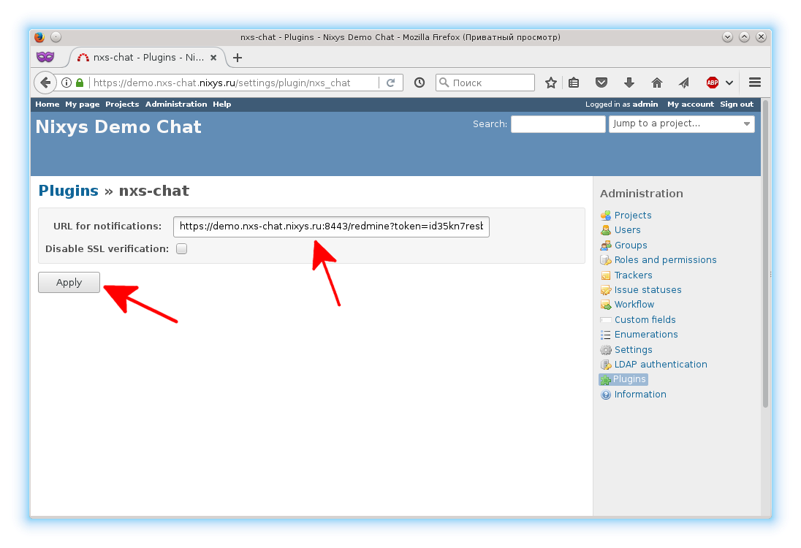

Optionally you can disable nxs-chat-srv SSL verification.

Edit the following option in /etc/nxs-chat-srv/nxs-chat-srv.conf config file:

* `redmine.auth_token`: generated secret string (e.g. `id35kn7resb536bfc8zywdgaugk1ur69cysowr2kpiq5ngw41q`)

#### Statuses

Go to https://demo.nxs-chat.nixys.ru/issue_statuses/new and create a few statuses:

* `New`
* `In progress`
* `Need feedback`
* `Resolved` (_Issue closed_)

Now you need to get the IDs of created statuses:

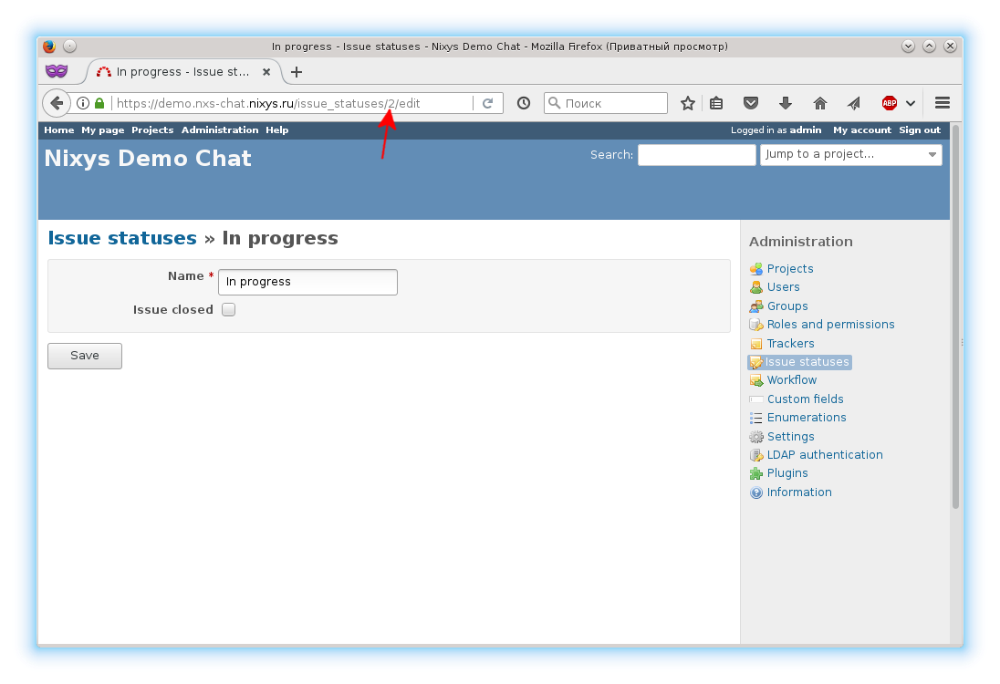

and insert them in the following options in /etc/nxs-chat-srv/nxs-chat-srv.conf config file:

* `redmine.status_in_progress`: ID of `In progress` status
* `redmine.status_need_feedback`: ID of `Need feedback` status
* `redmine.status_resolved`: ID of `Resolved` status

#### Trackers

You need one or more trackers to make possible issue processing in Redmine.

Go to https://demo.nxs-chat.nixys.ru/trackers/new and create a new tracker:

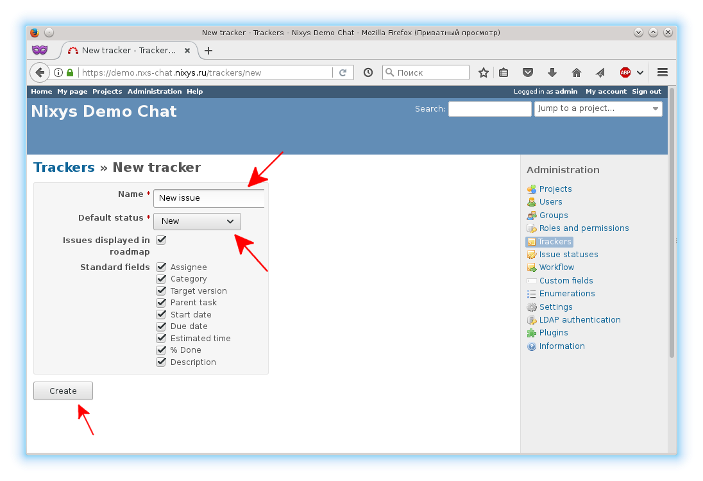

#### Roles

You need toone or more roles to make possible issue processing in Redmine.

Go to https://demo.nxs-chat.nixys.ru/roles/new and create a new role with the following permissions:

* `Project`:
  * `Create project`
  * `Edit project`
  * `Manage members`
  * `Create subprojects`
  * `Save queries`
  * `Manage public queries`
* `Issue tracking`:
  * `View Issues`
  * `Add issues`
  * `Edit issues`
  * `Set issues public or private`
  * `Set own issues public or private`
  * `Add notes`
  * `View private notes`
  * `Set notes as private`
  * `View watchers list`
  * `Add watchers`
  * `Delete watchers`

**Create the role**


**For demo version allow creating new projects for all registered users**

Go to https://demo.nxs-chat.nixys.ru/roles/1/edit and enable `Create project` option on `Project` block:


**For demo version set the role given to a non-admin user who creates a project**

Go to https://demo.nxs-chat.nixys.ru/settings?tab=projects and select option `Role given to a non-admin user who creates a project` to created role:

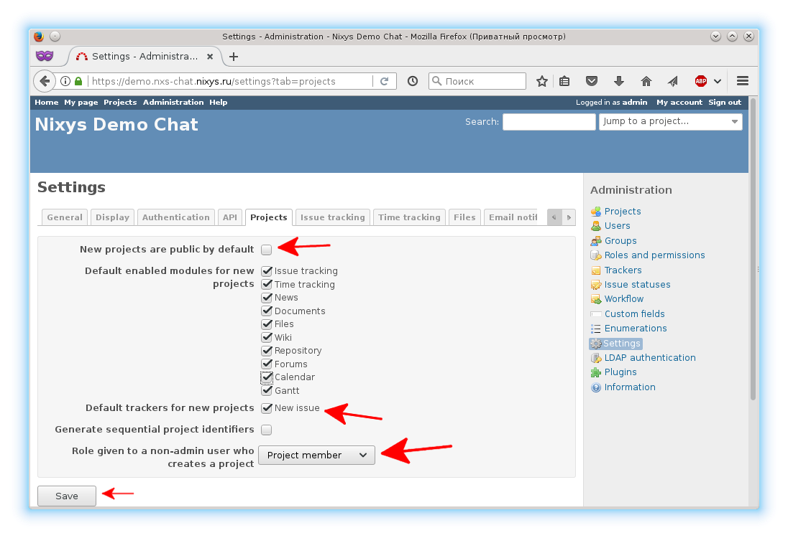

#### Workflow

Now go to https://demo.nxs-chat.nixys.ru/workflows/edit and make a workflow for created role and tracker:

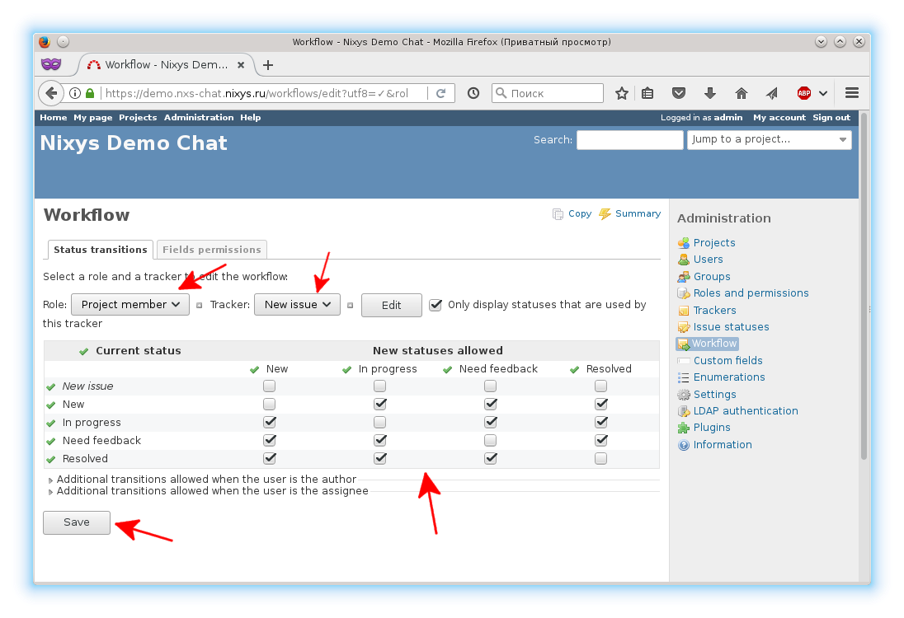

#### Priorities

You need one or more priorities to make possible issue processing in Redmine.

Go to https://demo.nxs-chat.nixys.ru/enumerations/new?type=IssuePriority and create the following priorities:

* `Low`
* `Normal` (Default value)
* `High`

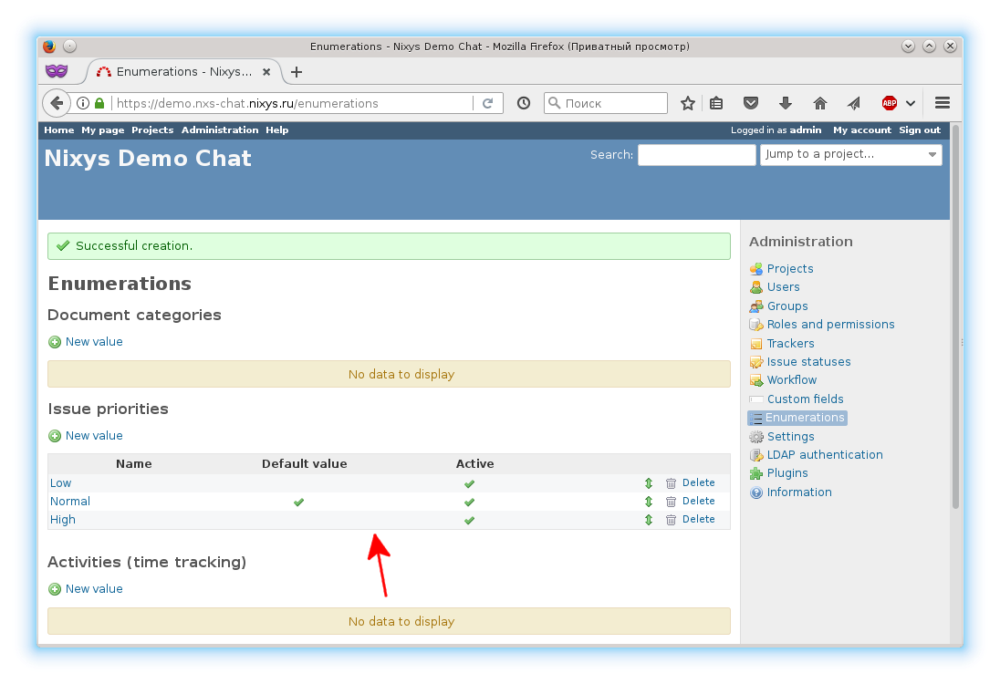

#### Custom fields

Now create a custom field for Telegram username. This field is required to link Telegram and Redmine accounts.

Go to https://demo.nxs-chat.nixys.ru/custom_fields/new and select the type of object to which the custom field shall be attached:

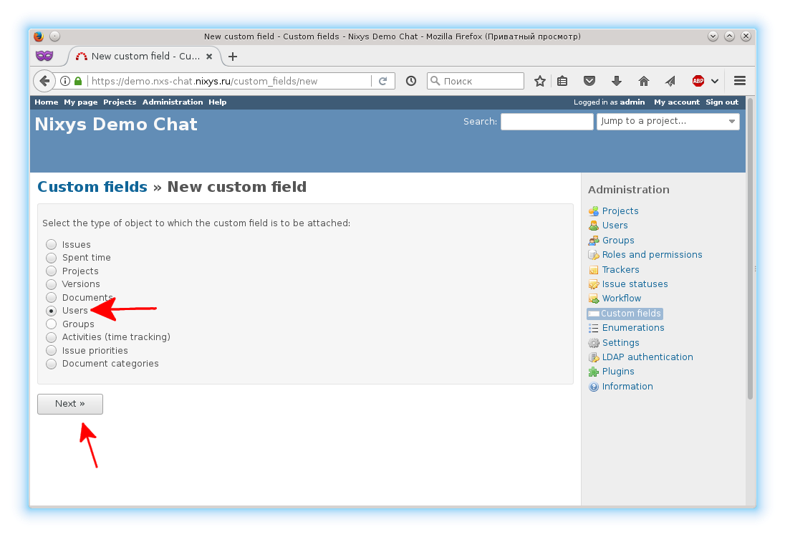

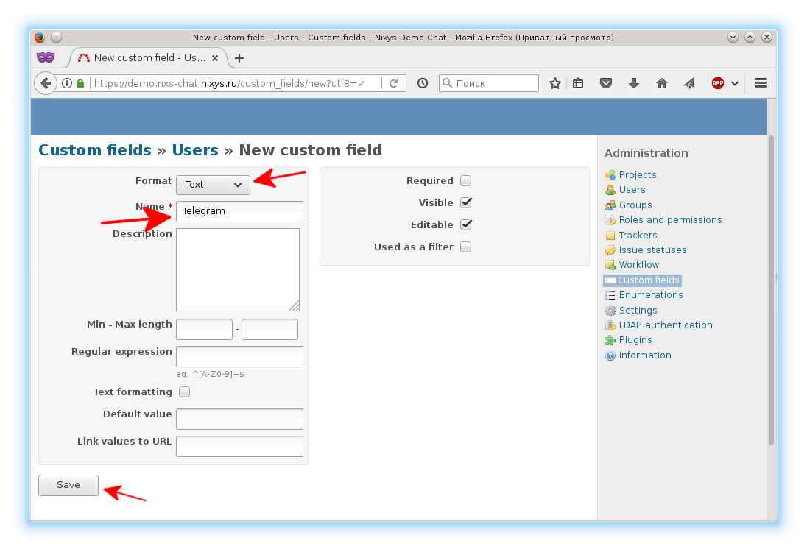

Get the created custom field ID:

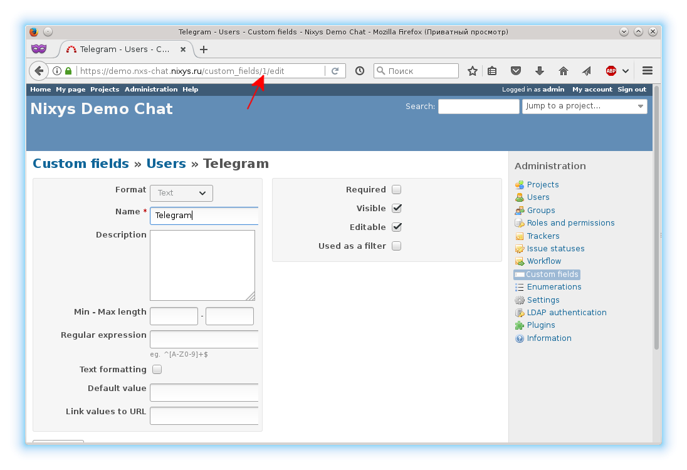

and insert it in the following option in /etc/nxs-chat-srv/nxs-chat-srv.conf config file:

* `redmine.cf_telegram`: ID of created custom field

#### Projects

Create the `Pre-sale` project to communicate with all no registered users.

Go to https://demo.nxs-chat.nixys.ru/projects/new and create a new project named `Pre-sale`.
Make sure that project options match the following:
* `Public`: false
* `Trackers`: New issue is enabled
 
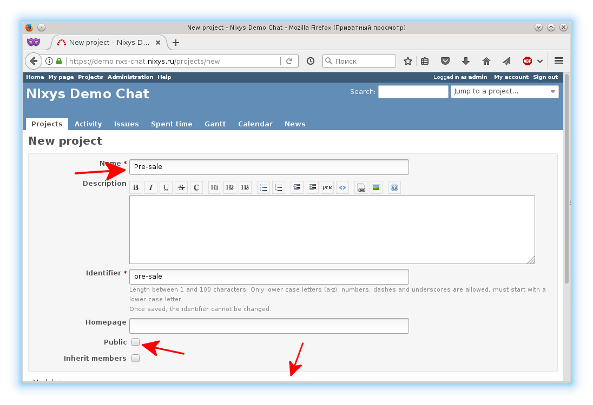

and insert its name in the following option in /etc/nxs-chat-srv/nxs-chat-srv.conf config file:

* `redmine.presale_project_name`: `Pre-sale`

#### Issues list query

Go to https://demo.nxs-chat.nixys.ru/projects/pre-sale/queries/new and create a query with the following required options:

* `Name`: you can use any name (e.g. `Telegram users issues list`)
* `Visible`: `to any users`
* `For all projects`: true

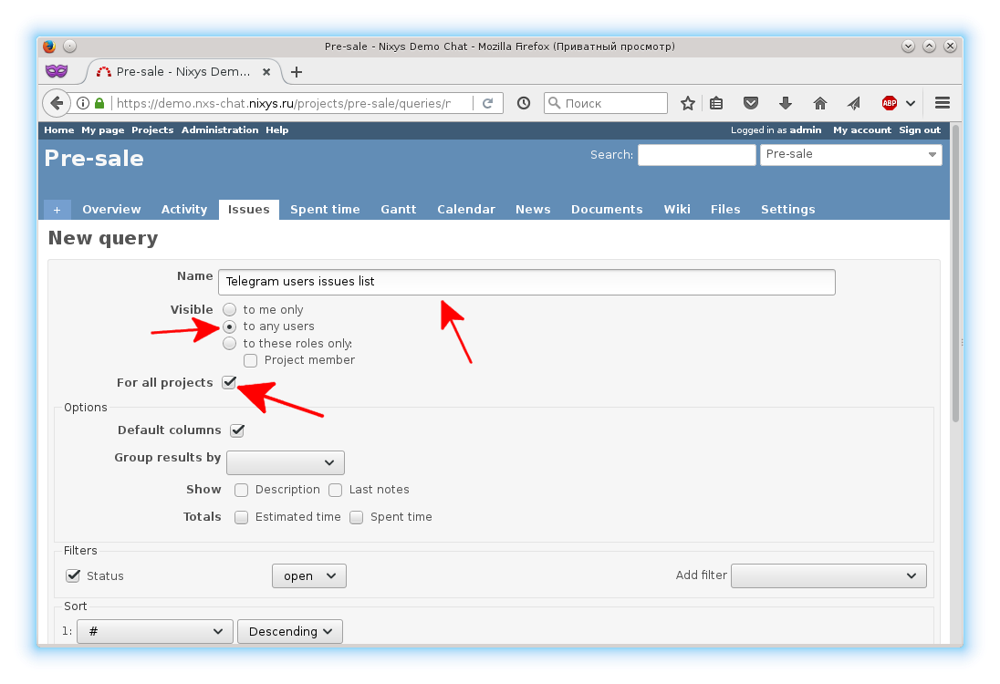

Get created query id:

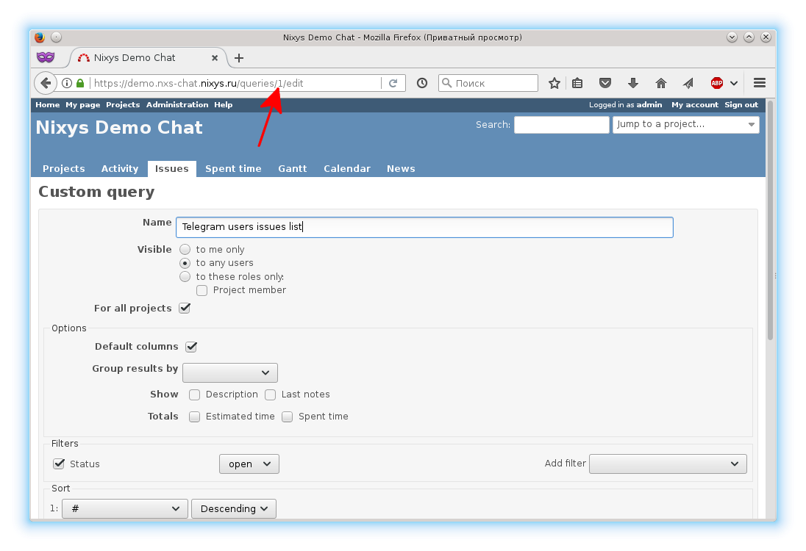

and insert it the following option in /etc/nxs-chat-srv/nxs-chat-srv.conf config file:

* `redmine.issue_list_query_id`: created query ID

#### Accounts

**Create an account with administrative permissions**

Go to https://demo.nxs-chat.nixys.ru/users/new and fill out the fields for the new account:

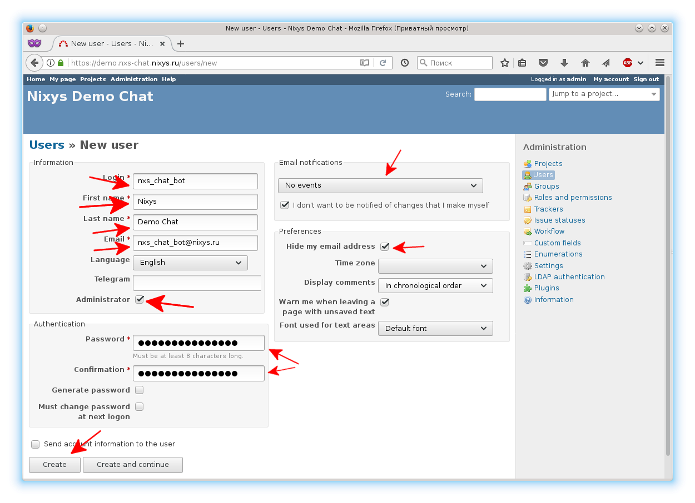

Now log in as the new user and get the Rest API key:

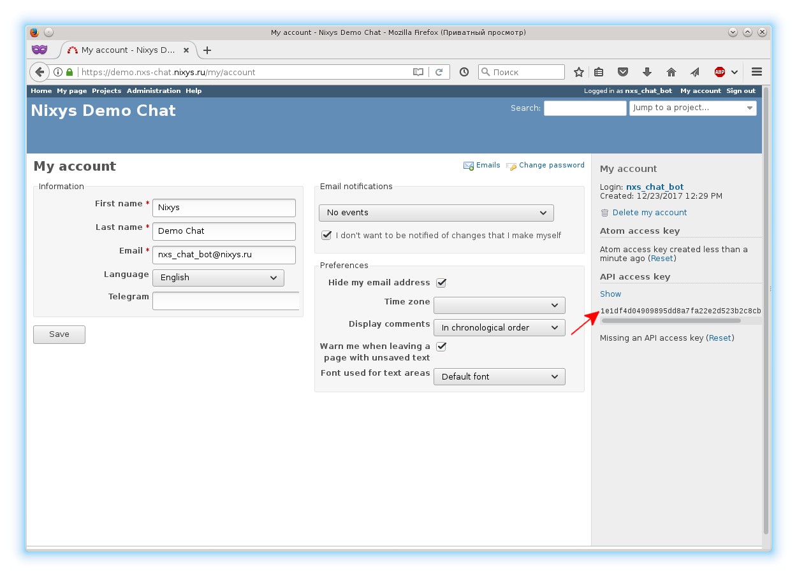

Insert it in the following option in /etc/nxs-chat-srv/nxs-chat-srv.conf config file:

* `redmine.api_key`: Rest API key for account with administrative permissions (e.g. `1e1df4d04909895dd8a7fa22e2d523b2c8cbf3fe`)

**Create presale account**

Go to https://demo.nxs-chat.nixys.ru/users/new and fill out the fields for the new account:

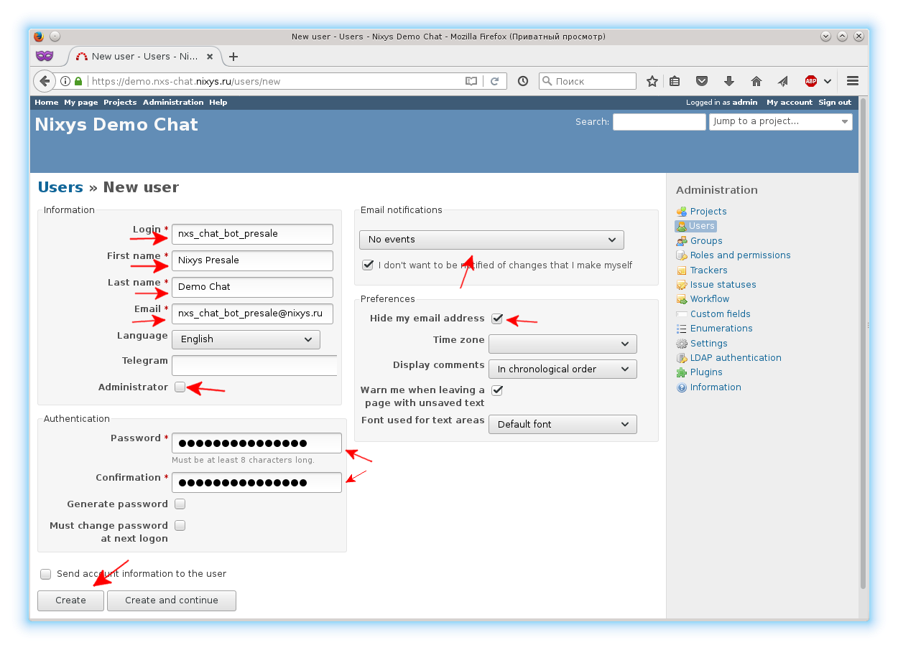

Now log in as the new user and get the Rest API key:


Insert it in the following option in /etc/nxs-chat-srv/nxs-chat-srv.conf config file:

* `redmine.presale_api_key`: Rest API key for presale account (e.g. `bf14e3d4e819485a2729109dad2c8d464741f941`)

### Nxs-chat-srv setting up

In addition to already specified settings you need to set the following blocks.

**Block `bind`**

In this block set bind address, port and path to SSL certificate and private key.

**Block `redmine`**

* `redmine.host`: specify the Redmine host URL (including protocol and port, e.g. http://127.0.0.1:3000)
* `redmine.ssl_verifyhost`: set to true if you want to verify Redmine SSL certificate or false otherwise

**Block `mysql`**

Create MySQL DB and specify the connection options in corresponding block in /etc/nxs-chat-srv/nxs-chat-srv.conf config file.

**Block `redis`**

Specify connection options in corresponding block in /etc/nxs-chat-srv/nxs-chat-srv.conf config file.

**Block `telegram`**

* `telegram.bot_api_key`: set the Telegram Bot API key
* `telegram.auth_token`: generate and set the secret string. This string is a part of URL path to make sure requests come from Telegram.
* `telegram.webhook_host`: specify the nxs-chat-srv host URL (including protocol and port, e.g. https://demo.nxs-chat.nixys.ru:8443)

**Bclock `statistic`**

* `statistic.auth_token`: generate and set the secret string. After that you may get nxs-chat-srv statistic by GET query https://demo.nxs-chat.nixys.ru/statistic?format=html&token=$_SECRETSTRING (e.g. https://demo.nxs-chat.nixys.ru/statistic?format=html&token=s14g3pzgkm70t0npw9c0hiqdn50jdl29ackgpwzcz5iujmle1x)

**Telegram bot initializaton**

Before the nxs-chat-srv has been starts you need to set Webhook in Telegram and populate the created MySQL DB.
 
* To set Webhook run nxs-chat-srv with one of the follows options:
  * In case the trusted SSL certificate is used:
  ```
  nxs-chat-srv -i set_webhook
  ```
  * In case the self-signed certificate is used (read this manual before: https://core.telegram.org/bots/self-signed):
  ```
  nxs-chat-srv -i set_webhook_self_signed_certificate
  ```
* To populate the created MySQL DB run nxs-chat-srv with follow option:
  ```
  nxs-chat-srv -i create_tables
  ```
